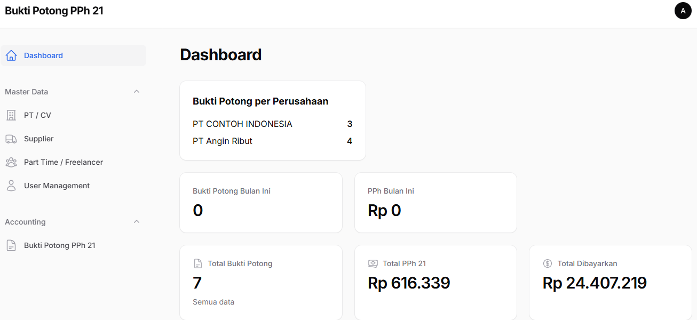

<p align="center">
  
</p>

<h1 align="center">Laravel + Filament Bukti Potong PPh 21</h1>

<p align="center">
  Bukti Potong PPh 21 <b>Laravel 11</b> and <b>FilamentPHP</b>.
  <br>Manage Tax, and more using a beautiful admin panel.
</p>

---

## 🚀 Features
 
- Powerful Filament Admin Dashboard  
- CRUD Master Data 
- Accounting Calculation  
- Dark/Light Mode  
- Fully responsive layout  

---

## 🖼 Demo Preview

### Website Preview



---

## ⚙️ Installation (Local)

```bash
git clone https://github.com/ketimusprime/bupot-pph21.git
cd bupot-pph21

composer install
npm install && npm run build

cp .env.example .env
php artisan key:generate

php artisan migrate --seed

php artisan serve
